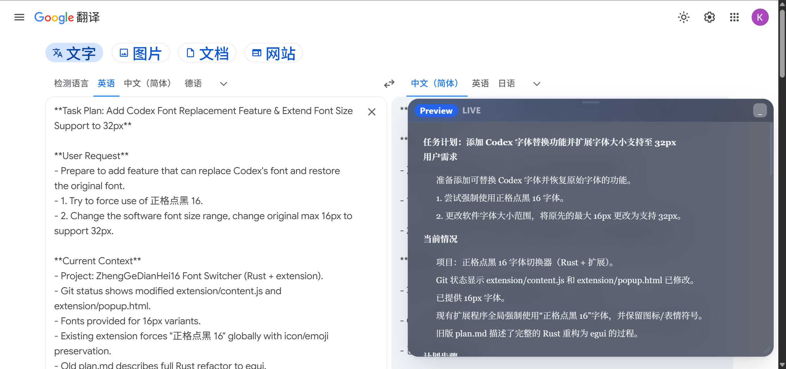

# Google Translate Markdown Preview

> Chrome / Edge Manifest V3 扩展，为 Google 翻译页面添加 Markdown 预览面板。
> A Chrome / Edge Manifest V3 extension that adds a Markdown preview panel to Google Translate.

## 功能简介 / Features

- 自动检测源文本是否为 Markdown 内容
- 读取 Google 翻译的翻译结果，在浮动预览窗口中渲染
- 预览窗口支持拖动、最小化，以及从边缘和四角缩放
- 提供设置页，可配置字体与默认窗口大小

- Detects whether the source text looks like Markdown
- Reads the translated result from Google Translate
- Renders the translated text inside a floating, draggable, minimizable and resizable Markdown preview window
- Includes an options page for font and default window settings

## 安装 / Install

1. 打开 Chrome 或 Edge 的扩展管理页 `chrome://extensions/`
2. 开启右上角 **"开发者模式"**
3. 点击 **"加载已解压的扩展程序"**
4. 选择本项目文件夹

1. Open the extensions page in Chrome or Edge
2. Turn on **Developer mode**
3. Click **"Load unpacked"**
4. Select this project's folder

## 使用 / Usage

在 Google 翻译页面上输入 Markdown 内容。当源文本被识别为 Markdown 时，页面头部会出现一个紧凑的 `MD` 开关，点击即可显示 / 隐藏翻译结果的 Markdown 预览。

Type Markdown into Google Translate. When the source text is detected as Markdown, a compact `MD` toggle appears in the page header — click it to show / hide the Markdown preview of the translated result.

## 截图 / Screenshots

## 技术要点 / Technical Notes

- 采用启发式方法定位翻译结果区域（Google 翻译页面结构经常变化）
- 内置零依赖 Markdown 渲染器，支持标题、列表、引用、行内代码、围栏代码块、强调、分隔线、链接
- 窗口几何信息保存在 `localStorage`；排版与默认字号保存在 `chrome.storage.sync`

- Uses heuristics to locate the translated result area (the Google Translate DOM changes frequently)
- Built-in zero-dependency Markdown renderer: headings, lists, blockquotes, inline code, fenced code blocks, emphasis, rules, links
- Window geometry is saved in `localStorage`; typography and default size are saved in `chrome.storage.sync`

## 开源协议 / License

Copyright © 2026 yaki1210. 本项目采用[知识共享署名-非商业性使用-相同方式共享 4.0 国际许可协议 (CC BY-NC-SA 4.0)](https://creativecommons.org/licenses/by-nc-sa/4.0/) 授权，详见 [LICENSE](LICENSE)。
This project is licensed under the [Creative Commons Attribution-NonCommercial-ShareAlike 4.0 International License (CC BY-NC-SA 4.0)](https://creativecommons.org/licenses/by-nc-sa/4.0/). See [LICENSE](LICENSE).
